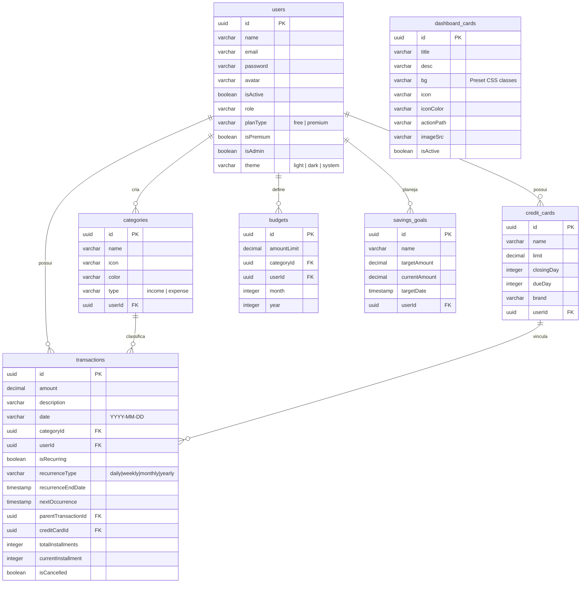

# FinControl Mobile — Especificação Completa & PRD Mestre (Android)

Este documento contém todo o contexto da aplicação FinControl para servir de insumo na criação do novo cliente nativo Android usando **Kotlin, Jetpack Compose e Material 3**. Ele descreve detalhadamente o escopo do produto (PRD), as diretrizes de branding, a arquitetura recomendada, o esquema do banco de dados (Supabase/PostgreSQL), as especificações da API REST e a mecânica das animações/interações (UI/UX).

---

## 1. Contexto Geral da Aplicação

O **FinControl** é um sistema moderno de controle financeiro pessoal. Ele foi originalmente desenvolvido como uma aplicação web baseada em React (Vite), TypeScript e Tailwind CSS, integrada a um backend em Node.js (com TypeORM e PostgreSQL hospedados no Supabase).

### Proposta de Valor
Ajudar os usuários a organizar suas finanças através de:
- **Visualização tátil e compacta**: Layouts limpos baseados em cartões e categorias no estilo Nubank.
- **Gestão de lançamentos**: Transações avulsas, parceladas ou recorrentes vinculadas a categorias e cartões de crédito.
- **Saúde financeira**: Carrossel de avisos, metas de economia e monitoramento de orçamentos por categoria.
- **Painel Administrativo**: Gestão de avisos e cards dinâmicos do Dashboard em tempo real.

---

## 2. Especificações do Projeto Mobile (Android)

A aplicação móvel Android deve ser construída seguindo as melhores práticas do ecossistema Android nativo:

### Stack Tecnológica
- **Linguagem**: Kotlin (versão LTS mais recente).
- **Interface Gráfica**: Jetpack Compose (declarativa, baseada em Kotlin compiler).
- **Design System**: Material Design 3 (Material 3) com suporte a Dynamic Color (M3) e temas Claro/Escuro automáticos.
- **Arquitetura**: MVVM (Model-View-ViewModel) + Clean Architecture (Camadas: Data, Domain, Presentation).
- **Banco de Dados Local**: Room Database (para cache de transações offline e suporte offline-first).
- **Injeção de Dependências**: Dagger Hilt (gerenciamento de escopos de ViewModel e Singletons de API).
- **Comunicação de Rede**: Retrofit 2 + OkHttp 3 (com interceptor de logs e interceptor de Token JWT).
- **Assincronismo**: Kotlin Coroutines + Flow (StateFlow para UI, SharedFlow para eventos únicos de navegação/toasts).
- **Navegação**: Jetpack Compose Navigation Component (Navegação baseada em rotas do tipo Type-safe).

---

## 3. Product Requirements Document (PRD)

### Requisito 1: Autenticação e Perfil
- **Fluxo de Acesso**: Tela de Login e Tela de Cadastro com validação de campos (e-mail, senha e nome).
- **Persistência**: Armazenamento seguro de tokens JWT (Access Token e Refresh Token) utilizando `EncryptedSharedPreferences`.
- **Preferências**: Toggle de Tema (Claro/Escuro/Seguir Sistema) em conformidade com o atributo `theme` da API.

### Requisito 2: Dashboard (Visão Geral)
- **Cabeçalho de Saldo**: Bloco azul sólido (`#0284c7` - Primary 600) que se estende sob a barra de status do celular (full-bleed). Exibe o Saldo do Mês com fonte Outfit em destaque e indicador de variação percentual baseada no mês anterior.
- **Carrossel de Atalhos Rápidos**: Lista horizontal de botões circulares no estilo Nubank ("Nova Transação", "Nova Categoria", "Cartões de Crédito", "Metas de Economia").
- **Carrossel de Avisos Dinâmicos**: Cards retangulares dinâmicos (`h-120px` na Web) que trazem notícias, alertas de segurança ou faturas a vencer direto da tabela `dashboard_cards`.
- **Dashboard Widgets**: Miniatura de progresso dos orçamentos mensais e metas ativas.

### Requisito 3: Lista de Transações
- **Navegação de Meses**: Seletor de período horizontal (botões anterior, próximo e botão rápido "Hoje").
- **Agrupamento por Datas**: Listagem de transações agrupadas em cards arredondados diários com cabeçalhos ("Hoje", "Ontem", "12 de Julho").
- **Filtros Expandíveis**: Painel expansível para buscar por texto e filtrar por tipo (Receitas/Despesas) e categorias.
- **Mecânica de Swipe (Ações Rápidas)**:
  - Arrastar um item para a esquerda revela os botões semânticos de ação.
  - O card deve travar aberto ("snap") ao atingir a largura das ações (ex: `-112dp` para transações avulsas e `-232dp` para recorrentes com 4 botões).
  - Tocar no cartão aberto ou abrir outro item na lista deve fechar o item atual imediatamente.

### Requisito 4: Modal de Nova Transação (Gatilho Rápido)
- **Entrada Numérica Gigante**: Display centralizado de valor com fonte Outifit Extra-Negrito (`text-4xl`).
- **Cards Seletores de Tipo**: Card tátil de Receita (Verde/Emerald) e Despesa (Vermelho/Danger) com borda semântica luminosa ativa.
- **Campos do Lançamento**: Descrição, Data (DatePicker embutido do Material 3), Categoria (BottomSheet tátil) e Cartão de Crédito (opcional).
- **Toggle de Recorrência**: Chave do tipo switch que, ao ser ativada, expande uma seção complementar (Frequência: Diária, Semanal, Mensal, Anual e quantidade de parcelas/limite de término).

### Requisito 5: Metas de Economia & Orçamentos
- **Metas**: Cadastro de objetivos financeiros com valor total, data-alvo, progresso visual (barra de progresso) e cálculo automático de quanto economizar por mês.
- **Orçamentos**: Vinculação de limites de gastos mensais por Categoria, mostrando barras de progresso que mudam de cor se atingirem 80% (Alerta - Laranja) ou 100% (Perigo - Vermelho) do orçamento.

---

## 4. Branding & Diretrizes de Design (Material 3 UI)

A interface do FinControl Mobile deve adotar uma estética limpa, moderna e sofisticada:

### Paleta de Cores
| Nome | Hexadecimal | Uso |
|---|---|---|
| **Primary** (Brand) | `#0284c7` (Primary 600) | Cabeçalho do Saldo, Botão Principal (FAB), Destaques |
| **Secondary** | `#4f46e5` (Indigo 600) | Cartões de Crédito, Atalhos Específicos |
| **Success** | `#10b981` (Emerald 500) | Receitas, Saldo Positivo, Indicadores de Ganho |
| **Danger** | `#ef4444` (Red 500) | Despesas, Alertas de Orçamentos Estourados |
| **Background Light** | `#f9fafb` (Gray 50) | Fundo da tela do aplicativo em modo claro |
| **Background Dark**| `#000000` (Black) | Fundo da tela do aplicativo em modo escuro |
| **Surface** | `#ffffff` / `#171717` (Neutral 900) | Fundo dos cards arredondados e caixas de diálogo |

### Tipografia
- **Títulos e Valores**: Usar fonte de estilo geométrico com grande peso (ex: `Outfit` ou `Montserrat` no Android) para números monetários e títulos grandes de páginas.
- **Textos de Apoio e Labels**: Usar `Roboto` ou `Inter` com pesos regulares e semibold para alta legibilidade.

---

## 5. Estrutura de Tabelas e Supabase (Database)

A aplicação sincroniza com o PostgreSQL hospedado no Supabase. O banco de dados possui as seguintes tabelas críticas e esquemas que o cliente móvel precisará mapear localmente via SQLite/Room:



---

## 6. APIs e Endpoints do Backend

Todas as requisições devem incluir o cabeçalho `Authorization: Bearer <Access_Token>` (com exceção das rotas de autenticação `/auth`).

### Prefixos
- **URL Base**: `http://<SEU_IP>:5000/api/v1`

### 1. Autenticação (`/auth`)
- `POST /auth/register`: Cadastro de usuário.
  - Body: `{ name, email, password }`
- `POST /auth/login`: Login de usuário.
  - Body: `{ email, password }`
  - Response: `{ user, accessToken, refreshToken }`
- `POST /auth/refresh`: Atualização de token expirado.
  - Body: `{ refreshToken }`
  - Response: `{ accessToken, refreshToken }`

### 2. Transações (`/transactions`)
- `GET /transactions?month=X&year=Y&type=Z&categoryId=W`: Obter transações filtradas.
- `POST /transactions`: Criar transação.
  - Body: `{ amount, description, date, type, categoryId, creditCardId, isRecurring, recurrenceType, recurrenceEndDate, totalInstallments }`
- `PUT /transactions/:id`: Atualizar transação.
- `DELETE /transactions/:id`: Excluir transação.

### 3. Painel (`/dashboard`)
- `GET /dashboard?month=X&year=Y`: Dados consolidados do Dashboard.
  - Response: `{ financialSummary: { monthBalance, income, expense }, lastMonthSummary: { balance } }`
- `GET /dashboard/cards`: Carrossel de avisos.
  - Response: `Array<{ id, title, desc, bg, icon, iconColor, actionPath, imageSrc }>`

### 4. Categorias (`/categories`)
- `GET /categories`: Obter todas as categorias.
- `POST /categories`: Criar nova categoria.
  - Body: `{ name, icon, color, type }`

### 5. Cartões de Crédito (`/credit-cards`)
- `GET /credit-cards`: Obter cartões cadastrados.
- `POST /credit-cards`: Cadastrar cartão.
  - Body: `{ name, limit, closingDay, dueDay, brand }`

---

## 7. Plano de Sincronização & Estratégia Offline-First

Para fornecer uma experiência móvel premium livre de travamentos causados por falhas de conectividade, o aplicativo adotará uma estratégia **Offline-First**:

1. **Camada de Dados como Fonte da Verdade**: A UI do Jetpack Compose consome dados diretamente das tabelas locais do banco de dados Room (usando `Flow<List<Transaction>>`).
2. **Fila de Sincronização (Sync Queue)**:
   - Toda criação/alteração/deleção feita offline é gravada na tabela SQLite local correspondente com uma flag `status_sincronizacao` (`PENDING_CREATE`, `PENDING_UPDATE`, `PENDING_DELETE`).
   - Um Worker em segundo plano (`WorkManager`) é enfileirado com restrição de rede conectada (`Constraints.Builder().setRequiredNetworkType(NetworkType.CONNECTED).build()`).
3. **Pipeline de Sync**:
   - Assim que o dispositivo recupera conexão, o `WorkManager` lê os itens da fila local.
   - Os dados pendentes são enviados para a API do backend na ordem cronológica de gravação.
   - Em caso de sucesso, o status é alterado para `SYNCED` localmente.
4. **Resolução de Conflitos (Last-Write-Wins)**:
   - A tabela local mantém a coluna `updated_at`. Ao sincronizar, o registro com data de modificação mais recente no dispositivo substitui o dado no banco de dados Supabase.

---

## 8. Prompt para o Gemini (Geração de Código)

Cole o prompt abaixo em uma nova sessão do Gemini para que ele atue como um engenheiro de software Android sênior especializado em FinTechs:

```text
Você é um desenvolvedor Android Sênior especializado em Kotlin, Jetpack Compose e Material Design 3.
Sua missão é desenvolver o aplicativo mobile FinControl Android com base nas especificações do arquivo MOBILE_CONTEXT_PRD.md.

Por favor, siga rigorosamente as seguintes diretrizes:
1. Use Clean Architecture dividindo o projeto em 3 módulos/pacotes principais:
   - :domain (Contém Modelos puros da aplicação, as regras de negócio de limite de transações e interfaces de Repositório).
   - :data (Implementa os Repositórios utilizando Room Database para banco de dados local offline-first e o Retrofit para consumo das APIs Node/Supabase).
   - :presentation (Implementa telas com Jetpack Compose, gerenciamento de estado por meio de ViewModels com StateFlow e DI com Dagger Hilt).

2. Desenvolva as seguintes telas prioritárias com acabamento visual sofisticado (Nubank-inspired):
   - Tela de Dashboard: Contendo cabeçalho full-bleed em azul sólido (#0284c7) para o saldo, carrossel de atalhos rápidos circulares e carrossel de avisos dinâmicos do banco de dados.
   - Tela de Transações: Implementando agrupamento de transações por cabeçalhos de data ("Hoje", "Ontem" e "08 de jul"). Cada dia agrupado deve possuir um card com cantos arredondados e borda sutil. Adicione gesto de Swipe com snap físico em Compose (usando AnchoredDraggable ou Swipeable) para revelar as opções de deletar, editar e detalhes. Ao tocar fora ou iniciar outro swipe, os cards anteriores devem se fechar automaticamente.
   - Modal BottomSheet de Nova Transação: Display numérico grande Outfit-style no centro, cards táteis de Seleção semântica de tipo (Receita em Emerald/Despesa em Red) e expansão animada por mola (spring) do toggle de recorrência.

Antes de escrever qualquer código de UI, crie a estrutura de dados das tabelas locais do Room e as assinaturas da API do Retrofit, garantindo a tipagem dos dados. Escreva código limpo, comentado em português (PT-BR) e 100% livre de placeholders.
```

---

## 9. Plano de Implementação para o Desenvolvedor

Abaixo está o checklist de passos ordenados para desenvolver o cliente Android do zero:

- [ ] **Fase 1: Configuração do Projeto e Hilt**
  - Configurar o Gradle do projeto adicionando suporte a plugins do Hilt, Room, Compose Compiler e Serialization de rotas de navegação.
  - Implementar a classe de aplicação principal `FinControlApplication` com `@HiltAndroidApp`.

- [ ] **Fase 2: Camada de Dados Local (Room Database)**
  - Criar as entidades Room para `User`, `Category`, `Transaction` e `CreditCard`.
  - Configurar a classe `AppDatabase` local e declarar os respectivos DAOs com fluxos reativos (`Flow`).

- [ ] **Fase 3: Camada de Comunicação com API (Retrofit)**
  - Implementar os contratos de requisição em interfaces Kotlin (ex: `AuthApi`, `TransactionApi`, `DashboardApi`).
  - Desenvolver o interceptor de rede OkHttp para adicionar o cabeçalho Bearer do Token e o fluxo de renovação automática via Refresh Token no caso de erro `401 Unauthorized`.

- [ ] **Fase 4: Core Domain & Repositórios**
  - Implementar os repositórios injetados no Hilt com a lógica de decisão: "Verificar se há rede -> Se sim, bater na API, atualizar o banco local e retornar; Se não, ler diretamente do banco local".

- [ ] **Fase 5: Interface do Dashboard (Estilo Nubank)**
  - Desenvolver o Cabeçalho de Saldo dinâmico que ignora a status-bar e desenha o fundo azul.
  - Construir o carrossel horizontal de atalhos rápidos e de avisos.

- [ ] **Fase 6: Interface de Transações e Gestos de Swipe**
  - Montar a listagem agrupada por dia.
  - Criar o componente de item de transação utilizando `Modifier.anchoredDraggable` para obter o snap físico magnético nos pontos das ações.

- [ ] **Fase 7: Sincronização Automática com WorkManager**
  - Criar a classe `SyncWorker` herdada de `CoroutineWorker`.
  - Definir o agendamento de sincronização para quando o dispositivo ganhar conectividade estável com a internet.
