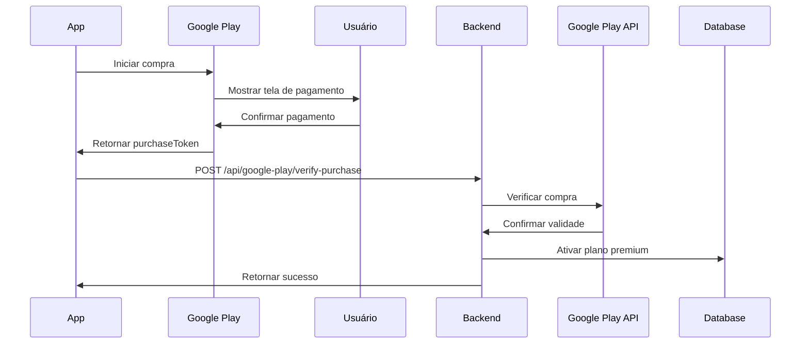
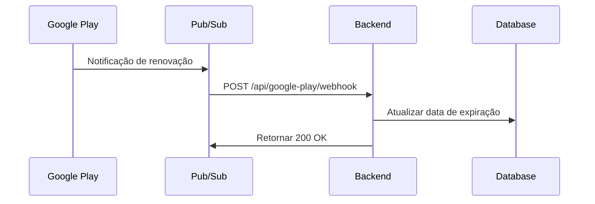

# 🎮 Configuração do Google Play Billing

Este guia explica como configurar e integrar o Google Play Billing para assinaturas no FinControl.

## 📋 Pré-requisitos

1. Conta de desenvolvedor do Google Play Console
2. Aplicativo Android publicado (ou em teste interno/fechado)
3. Conta de serviço do Google Cloud Platform

---

## 🔧 Configuração no Google Play Console

### 1. Criar Produtos de Assinatura

1. Acesse [Google Play Console](https://play.google.com/console)
2. Selecione seu aplicativo
3. Navegue para **Monetização** > **Produtos** > **Assinaturas**
4. Clique em **Criar assinatura**

#### Produto Recomendado:

**ID do Produto:** `premium_monthly`
- **Nome:** Plano Premium Mensal
- **Descrição:** Acesso ilimitado a todas as funcionalidades premium
- **Preço:** R$ 12,50/mês (ou conforme sua estratégia)
- **Período de cobrança:** Mensal
- **Período de teste:** 7 dias (opcional)

### 2. Configurar Conta de Serviço

1. Acesse [Google Cloud Console](https://console.cloud.google.com)
2. Crie um novo projeto ou selecione existente
3. Ative a **Google Play Android Developer API**
4. Crie uma **Conta de Serviço**:
   - Nome: `fincontrol-billing-service`
   - Função: **Editor**
5. Crie uma chave JSON para a conta de serviço
6. Baixe o arquivo JSON

### 3. Vincular Conta de Serviço ao Google Play

1. No Google Play Console, vá em **Configurações** > **Acesso à API**
2. Vincule seu projeto do Google Cloud
3. Conceda permissões à conta de serviço:
   - ✅ Visualizar dados financeiros
   - ✅ Gerenciar pedidos e assinaturas

### 4. Configurar Notificações em Tempo Real (RTDN)

1. No Google Play Console, vá em **Monetização** > **Configurações de monetização**
2. Configure o **Tópico do Cloud Pub/Sub**:
   - Crie um tópico no Google Cloud Pub/Sub
   - Nome sugerido: `google-play-subscriptions`
3. Configure o endpoint de webhook:
   ```
   https://seu-dominio.com/api/v1/google-play/webhook
   ```

---

## 🔐 Configuração do Backend

### 1. Variáveis de Ambiente

Adicione ao arquivo `.env`:

```env
# Google Play Billing
GOOGLE_PLAY_PACKAGE_NAME=com.fincontrol.app
GOOGLE_PLAY_SERVICE_ACCOUNT_KEY_PATH=./google-play-service-account.json
```

### 2. Arquivo de Credenciais

1. Coloque o arquivo JSON da conta de serviço na raiz do backend
2. Renomeie para `google-play-service-account.json`
3. **IMPORTANTE:** Adicione ao `.gitignore`:
   ```
   google-play-service-account.json
   ```

### 3. Instalar Dependências

```bash
cd backend
npm install googleapis
```

---

## 📱 Integração no Frontend (React Native/Capacitor)

### 1. Instalar Biblioteca de Billing

Para React Native:
```bash
npm install react-native-iap
```

Para Capacitor:
```bash
npm install @capgo/capacitor-purchases
```

### 2. Código de Exemplo (React Native)

```typescript
import * as RNIap from 'react-native-iap';

// IDs dos produtos
const productIds = ['premium_monthly'];

// Inicializar
await RNIap.initConnection();

// Obter produtos disponíveis
const products = await RNIap.getSubscriptions(productIds);

// Comprar assinatura
const purchase = await RNIap.requestSubscription({
  sku: 'premium_monthly',
});

// Enviar para backend para verificação
const response = await fetch('https://api.fincontrol.com/api/v1/google-play/verify-purchase', {
  method: 'POST',
  headers: {
    'Content-Type': 'application/json',
    'Authorization': `Bearer ${userToken}`,
  },
  body: JSON.stringify({
    purchaseToken: purchase.purchaseToken,
    subscriptionId: 'premium_monthly',
    productId: purchase.productId,
  }),
});

// Finalizar compra
await RNIap.finishTransaction(purchase);
```

---

## 🔄 Fluxo de Assinatura

### 1. Compra Inicial



### 2. Renovação Automática



---

## 🧪 Testes

### 1. Testers Licenciados

1. No Google Play Console, adicione contas de teste
2. Configure em **Configurações** > **Testers licenciados**
3. Essas contas podem fazer compras de teste sem cobrança real

### 2. Testar Webhook Localmente

Use ngrok para expor seu servidor local:

```bash
ngrok http 5000
```

Configure o webhook no Google Play Console com a URL do ngrok.

---

## 📊 Endpoints da API

### POST /api/google-play/verify-purchase
Verificar e ativar assinatura após compra

**Body:**
```json
{
  "purchaseToken": "token_from_google_play",
  "subscriptionId": "premium_monthly",
  "productId": "premium_monthly"
}
```

### POST /api/google-play/webhook
Receber notificações em tempo real (RTDN)

### POST /api/google-play/cancel-subscription
Cancelar assinatura do usuário

### GET /api/google-play/subscription-status
Obter status atual da assinatura

---

## 🚨 Tratamento de Erros

### Erros Comuns

1. **401 Unauthorized**: Credenciais inválidas
   - Verifique o arquivo JSON da conta de serviço
   - Confirme que a API está ativada no Google Cloud

2. **403 Forbidden**: Sem permissões
   - Verifique as permissões da conta de serviço no Google Play Console

3. **404 Not Found**: Produto não encontrado
   - Confirme que o subscriptionId está correto
   - Verifique se o produto está ativo no Google Play Console

---

## 🔒 Segurança

### Boas Práticas

1. ✅ **SEMPRE** verificar compras no backend
2. ✅ Armazenar purchaseToken de forma segura
3. ✅ Validar assinaturas antes de conceder acesso premium
4. ✅ Implementar rate limiting nos endpoints
5. ✅ Usar HTTPS em produção
6. ❌ **NUNCA** confiar apenas na validação do frontend

### Proteção contra Fraudes

- Verificar `orderId` único por compra
- Validar `expiryTimeMillis` antes de conceder acesso
- Monitorar `paymentState` (1 = pago, 0 = pendente)
- Implementar logs de auditoria

---

## 📈 Monitoramento

### Métricas Importantes

- Taxa de conversão (trial → pago)
- Taxa de renovação mensal
- Taxa de cancelamento (churn)
- Receita mensal recorrente (MRR)

### Logs

O sistema registra automaticamente:
- ✅ Compras verificadas
- ✅ Renovações automáticas
- ✅ Cancelamentos
- ✅ Expirações
- ❌ Tentativas de fraude

---

## 🆘 Suporte

### Documentação Oficial

- [Google Play Billing](https://developer.android.com/google/play/billing)
- [Google Play Developer API](https://developers.google.com/android-publisher)
- [Real-time Developer Notifications](https://developer.android.com/google/play/billing/rtdn-reference)

### Problemas Conhecidos

1. **Delay nas notificações**: Pode levar até 48h em alguns casos
2. **Testes em produção**: Use contas de teste licenciadas
3. **Renovações**: Podem falhar se o cartão expirar

---

## ✅ Checklist de Produção

- [ ] Produtos de assinatura criados no Google Play Console
- [ ] Conta de serviço configurada e vinculada
- [ ] Arquivo JSON de credenciais no servidor (fora do Git)
- [ ] Variáveis de ambiente configuradas
- [ ] Webhook configurado e testado
- [ ] Testes com contas licenciadas realizados
- [ ] Logs de auditoria implementados
- [ ] Monitoramento de métricas ativo
- [ ] Política de privacidade atualizada
- [ ] Termos de serviço atualizados

---

## 💰 Preços Sugeridos

### Brasil (BRL)
- **Mensal**: R$ 12,50/mês
- **Anual**: R$ 99,90/ano (33% desconto)

### Outros Mercados
- Use a ferramenta de preços do Google Play Console
- Considere paridade de poder de compra (PPP)
- Ofereça período de teste de 7 dias

---

**Última atualização:** Janeiro 2026
**Versão:** 1.0.0
