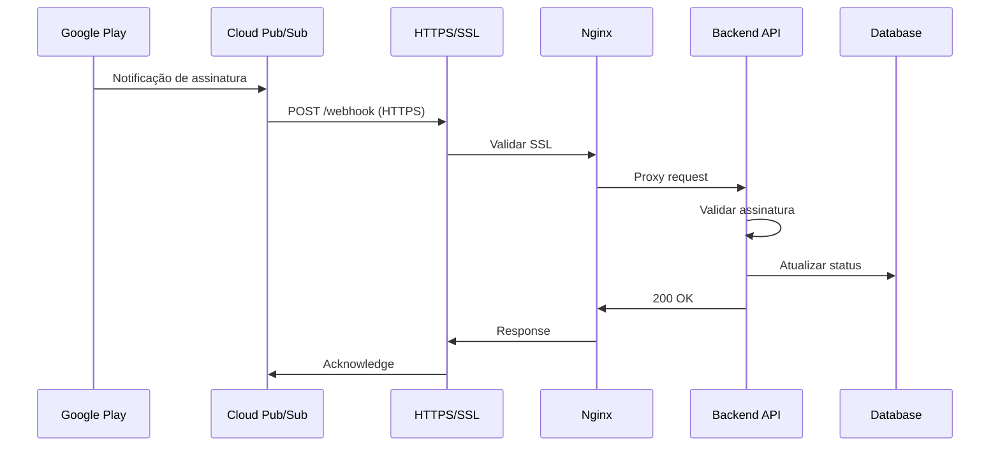

# 🔐 Configuração de Webhook HTTPS em Produção

Guia completo para configurar o webhook do Google Play com HTTPS em ambiente de produção.

---

## 📋 Pré-requisitos

- ✅ Servidor com domínio próprio (ex: `api.fincontrol.com`)
- ✅ Certificado SSL/TLS válido (Let's Encrypt recomendado)
- ✅ Backend rodando em produção
- ✅ Google Cloud Pub/Sub configurado

---

## 🌐 Opções de Deploy

### Opção 1: VPS com Nginx (Recomendado)

#### 1.1. Configurar Nginx como Reverse Proxy

Crie o arquivo `/etc/nginx/sites-available/fincontrol-api`:

```nginx
server {
    listen 80;
    server_name api.fincontrol.com;
    
    # Redirecionar HTTP para HTTPS
    return 301 https://$server_name$request_uri;
}

server {
    listen 443 ssl http2;
    server_name api.fincontrol.com;

    # Certificados SSL (Let's Encrypt)
    ssl_certificate /etc/letsencrypt/live/api.fincontrol.com/fullchain.pem;
    ssl_certificate_key /etc/letsencrypt/live/api.fincontrol.com/privkey.pem;
    
    # Configurações SSL recomendadas
    ssl_protocols TLSv1.2 TLSv1.3;
    ssl_ciphers HIGH:!aNULL:!MD5;
    ssl_prefer_server_ciphers on;
    
    # Headers de segurança
    add_header Strict-Transport-Security "max-age=31536000; includeSubDomains" always;
    add_header X-Frame-Options "SAMEORIGIN" always;
    add_header X-Content-Type-Options "nosniff" always;
    
    # Logs
    access_log /var/log/nginx/fincontrol-api.access.log;
    error_log /var/log/nginx/fincontrol-api.error.log;
    
    # Proxy para o backend Node.js
    location / {
        proxy_pass http://localhost:5000;
        proxy_http_version 1.1;
        proxy_set_header Upgrade $http_upgrade;
        proxy_set_header Connection 'upgrade';
        proxy_set_header Host $host;
        proxy_set_header X-Real-IP $remote_addr;
        proxy_set_header X-Forwarded-For $proxy_add_x_forwarded_for;
        proxy_set_header X-Forwarded-Proto $scheme;
        proxy_cache_bypass $http_upgrade;
        
        # Timeouts
        proxy_connect_timeout 60s;
        proxy_send_timeout 60s;
        proxy_read_timeout 60s;
    }
    
    # Webhook específico do Google Play
    location /api/v1/google-play/webhook {
        proxy_pass http://localhost:5000;
        proxy_http_version 1.1;
        proxy_set_header Host $host;
        proxy_set_header X-Real-IP $remote_addr;
        proxy_set_header X-Forwarded-For $proxy_add_x_forwarded_for;
        proxy_set_header X-Forwarded-Proto $scheme;
        
        # Aumentar timeout para webhooks
        proxy_read_timeout 120s;
        
        # Logs específicos para webhook
        access_log /var/log/nginx/webhook.access.log;
        error_log /var/log/nginx/webhook.error.log;
    }
}
```

#### 1.2. Instalar Certificado SSL com Let's Encrypt

```bash
# Instalar Certbot
sudo apt update
sudo apt install certbot python3-certbot-nginx

# Obter certificado SSL
sudo certbot --nginx -d api.fincontrol.com

# Renovação automática (já configurada pelo Certbot)
sudo certbot renew --dry-run
```

#### 1.3. Ativar configuração

```bash
# Criar link simbólico
sudo ln -s /etc/nginx/sites-available/fincontrol-api /etc/nginx/sites-enabled/

# Testar configuração
sudo nginx -t

# Recarregar Nginx
sudo systemctl reload nginx
```

---

### Opção 2: Serviços de Cloud (Mais Simples)

#### 2.1. Railway.app

```bash
# 1. Instalar Railway CLI
npm install -g @railway/cli

# 2. Login
railway login

# 3. Inicializar projeto
railway init

# 4. Deploy
railway up

# 5. Adicionar domínio customizado
railway domain add api.fincontrol.com
```

**Configuração automática:**
- ✅ HTTPS automático
- ✅ Certificado SSL gerenciado
- ✅ Renovação automática

#### 2.2. Render.com

1. Conecte seu repositório GitHub
2. Configure o serviço:
   - **Build Command:** `cd backend && npm install`
   - **Start Command:** `cd backend && npm start`
3. Adicione domínio customizado em Settings
4. HTTPS é automático

#### 2.3. Heroku

```bash
# 1. Instalar Heroku CLI
npm install -g heroku

# 2. Login
heroku login

# 3. Criar app
heroku create fincontrol-api

# 4. Deploy
git push heroku main

# 5. Adicionar domínio
heroku domains:add api.fincontrol.com
```

---

## 🔔 Configurar Google Cloud Pub/Sub

### 1. Criar Tópico Pub/Sub

```bash
# Instalar gcloud CLI
# https://cloud.google.com/sdk/docs/install

# Login
gcloud auth login

# Criar tópico
gcloud pubsub topics create google-play-subscriptions

# Criar subscription (push)
gcloud pubsub subscriptions create fincontrol-webhook \
  --topic=google-play-subscriptions \
  --push-endpoint=https://api.fincontrol.com/api/v1/google-play/webhook \
  --ack-deadline=60
```

### 2. Configurar no Google Play Console

1. Acesse [Google Play Console](https://play.google.com/console)
2. Selecione seu app
3. Vá em **Monetização** > **Configurações de monetização**
4. Em **Notificações em tempo real**:
   - **Tópico do Cloud Pub/Sub:** `projects/SEU_PROJECT_ID/topics/google-play-subscriptions`
5. Clique em **Salvar**

---

## 🔒 Segurança do Webhook

### 1. Validar Origem das Requisições

Adicione ao controller do webhook:

```typescript
async handleWebhook(req: Request, res: Response): Promise<void> {
  try {
    // Validar que a requisição vem do Google Cloud Pub/Sub
    const pubsubVerificationToken = req.headers['x-goog-pubsub-verification-token'];
    
    if (pubsubVerificationToken) {
      // Primeira requisição de verificação
      res.status(200).send(pubsubVerificationToken);
      return;
    }

    // Validar assinatura (opcional mas recomendado)
    const signature = req.headers['x-goog-pubsub-signature'];
    if (!signature) {
      res.status(401).json({ error: 'Missing signature' });
      return;
    }

    // Processar notificação...
    const { message } = req.body;
    // ... resto do código
  } catch (error) {
    console.error('Webhook error:', error);
    res.status(200).json({ success: true }); // Sempre retornar 200
  }
}
```

### 2. Rate Limiting

Adicione rate limiting específico para o webhook:

```typescript
import rateLimit from 'express-rate-limit';

const webhookLimiter = rateLimit({
  windowMs: 1 * 60 * 1000, // 1 minuto
  max: 100, // 100 requisições por minuto
  message: 'Too many webhook requests',
  standardHeaders: true,
  legacyHeaders: false,
});

router.post('/webhook', webhookLimiter, googlePlayController.handleWebhook);
```

### 3. Logs e Monitoramento

```typescript
// Adicionar logging detalhado
import winston from 'winston';

const webhookLogger = winston.createLogger({
  level: 'info',
  format: winston.format.json(),
  transports: [
    new winston.transports.File({ 
      filename: 'logs/webhook-error.log', 
      level: 'error' 
    }),
    new winston.transports.File({ 
      filename: 'logs/webhook.log' 
    }),
  ],
});

// No controller
webhookLogger.info('Webhook received', {
  timestamp: new Date().toISOString(),
  notificationType: subscriptionNotification?.notificationType,
  subscriptionId: subscriptionNotification?.subscriptionId,
});
```

---

## 🧪 Testar Webhook em Produção

### 1. Testar Conectividade

```bash
# Testar endpoint
curl -X POST https://api.fincontrol.com/api/v1/google-play/webhook \
  -H "Content-Type: application/json" \
  -d '{"test": true}'
```

### 2. Simular Notificação do Google Play

```bash
# Publicar mensagem de teste no Pub/Sub
gcloud pubsub topics publish google-play-subscriptions \
  --message='{"test": "notification"}'
```

### 3. Monitorar Logs

```bash
# Logs do Nginx
sudo tail -f /var/log/nginx/webhook.access.log
sudo tail -f /var/log/nginx/webhook.error.log

# Logs do backend
tail -f backend/logs/webhook.log

# Logs do Pub/Sub
gcloud logging read "resource.type=pubsub_subscription" --limit 50
```

---

## 📊 Monitoramento em Produção

### 1. Health Check

Adicione endpoint de health check:

```typescript
router.get('/health', (req, res) => {
  res.json({
    status: 'ok',
    timestamp: new Date().toISOString(),
    uptime: process.uptime(),
  });
});
```

### 2. Alertas

Configure alertas no Google Cloud Monitoring:

```bash
# Criar alerta para falhas no webhook
gcloud alpha monitoring policies create \
  --notification-channels=CHANNEL_ID \
  --display-name="Webhook Failures" \
  --condition-display-name="High error rate" \
  --condition-threshold-value=10 \
  --condition-threshold-duration=60s
```

---

## 🔄 Fluxo Completo em Produção



---

## ✅ Checklist de Produção

- [ ] Domínio configurado e apontando para o servidor
- [ ] Certificado SSL válido instalado
- [ ] Nginx configurado como reverse proxy
- [ ] Backend rodando em produção (PM2/systemd)
- [ ] Tópico Pub/Sub criado no Google Cloud
- [ ] Subscription push configurada
- [ ] Webhook configurado no Google Play Console
- [ ] Rate limiting implementado
- [ ] Logs configurados e monitorados
- [ ] Health check endpoint ativo
- [ ] Alertas configurados
- [ ] Testes de conectividade realizados
- [ ] Documentação de incidentes preparada

---

## 🆘 Troubleshooting

### Problema: Webhook não recebe notificações

**Soluções:**
1. Verificar se o endpoint está acessível publicamente
2. Confirmar que o certificado SSL é válido
3. Verificar logs do Pub/Sub
4. Testar manualmente com curl

### Problema: Certificado SSL expirado

**Solução:**
```bash
# Renovar manualmente
sudo certbot renew

# Verificar renovação automática
sudo systemctl status certbot.timer
```

### Problema: Timeout no webhook

**Solução:**
- Aumentar timeouts no Nginx
- Otimizar processamento no backend
- Usar processamento assíncrono

---

**Última atualização:** Janeiro 2026
**Versão:** 1.0.0
